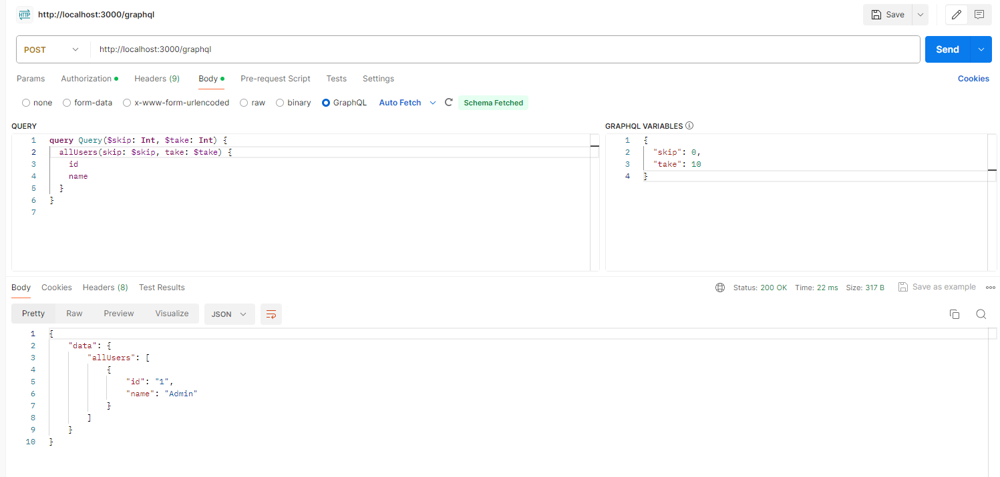
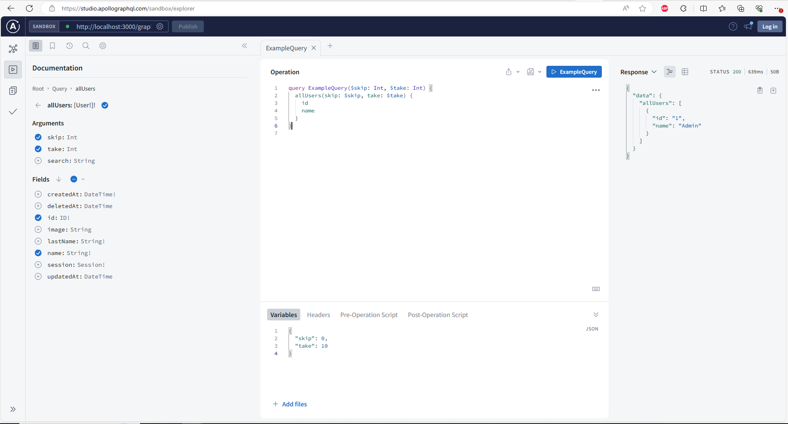
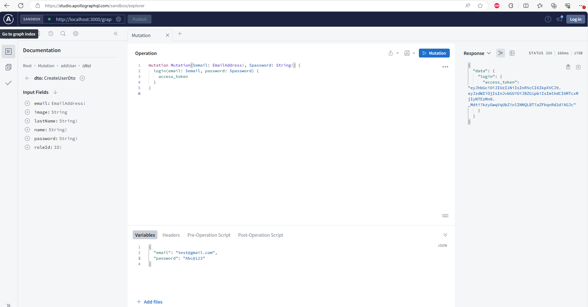
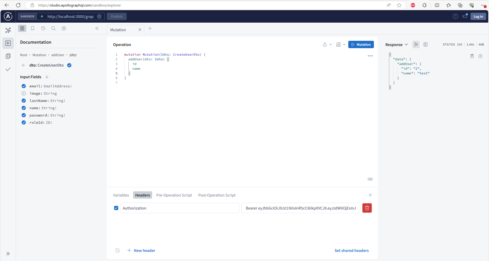

## Description

It is a User CRUD api on Express-JS, GraphQL and PostgreSQL(Prisma). You can:
1. Login, Register.
2. Authentication (passport)
3. CRUD User.

Access Apollo Server: http://localhost:<port>/graphql

## Getting Started

### Prerequisites

Run the following command to install dependencies:

```shell
npm install
```

### Run with docker

Run the following command to build PostgreSQL instance:

```shell
docker-compose up -d postgres
```

### Environment variables

This project depends on some environment variables.
If you are running this project locally, create a `.env` file at the root for these variables.
Your host provider should included a feature to set them there directly to avoid exposing them.

Here are the required ones:

```
#Database env
DB_HOST=
DB_ENGINE=
DB_NAME=
DB_PORT=
DB_USER=
DB_PASSWORD=
DB_CONNECT_TIMEOUT=
DATABASE_URL=${DB_ENGINE}://${DB_USER}:${DB_PASSWORD}@${DB_HOST}:${DB_PORT}/${DB_NAME}?schema=public&connect_timeout=${DB_CONNECT_TIMEOUT}

#Application env
PORT=
JWT_SECRET=

#Seed db
MASTER_PASS=
```

### Apply any SQL migration script

Run the following command to create/update your database based on existing sql migration scripts:

```shell
npm run update-database
```

### Seed the database

The project includes a seed script to populate the database:

```shell
npm run seed-db
```

### Run the project

Run the following command to run the project:

```shell
npm run build
npm run start
```

### Test
Test on Postman


Test on Apollo Server


Run with the authorization Query
  Step 1: Get access token
    
  Step 2: Set token on Headers with Authorization type 
    
    
## Stay in touch

- Email - nguyentrung96dn@gmail.com
- Linkedin - [linkedin.com](https://www.linkedin.com/in/trungnguyen-be/)